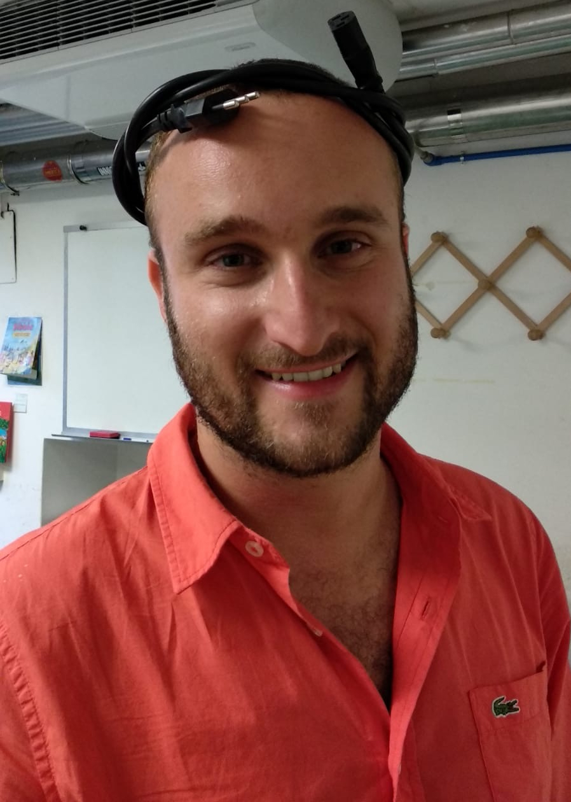

# Andrea Gallegati

Hi there! **I'm an aerospace engineer. I love programming** — that’s why I decided to write my CV in LaTeX.

I set up this project in a `devcontainer`: my CV is automatically built at every push/merge into the master branch and deployed to this GitHub Page.

**You can download any version of it, here:**

- [Detailed CV](./long.pdf) (Extended Version)  
- [One-Pager](./short.pdf) (Short Version)

*Made with ❤️ and GenAI. Scrapers welcome (I come in peace). ✌️🤖*

---

I got a PhD in Turbulence and Numerical Fluid Mechanics, where I worked extensively with **High Performance Computing (HPC)**, large-scale numerical simulations, and parallel computing architectures.

That experience shaped the way I think about systems: **scalability, performance optimization, distributed workloads, and computational efficiency**. Working daily on multi-node HPC environments exposed me to the **same foundational challenges that underpin modern AI systems** — data-intensive processing, algorithmic efficiency, orchestration, and compute-aware design.

Over time, my interest naturally expanded from computational science to software engineering, security, and AI-driven systems.

Today, **I approach Artificial Intelligence with a systems engineering mindset**. I’m particularly interested in:

- AI infrastructure and **scalable compute architectures**
- Automation within **complex environments**
- The **business value proposition** and organizational impact of AI
- **Security and safety** of agentic AI systems
- Responsible AI (RAI) and **robust architectural governance**

My background in HPC, cloud technologies, containerization, and orchestration make me think of AI not just as models — but **as end-to-end systems operating across cloud-to-edge** environments.

I hope you enjoy reading about me. Happy coding!

